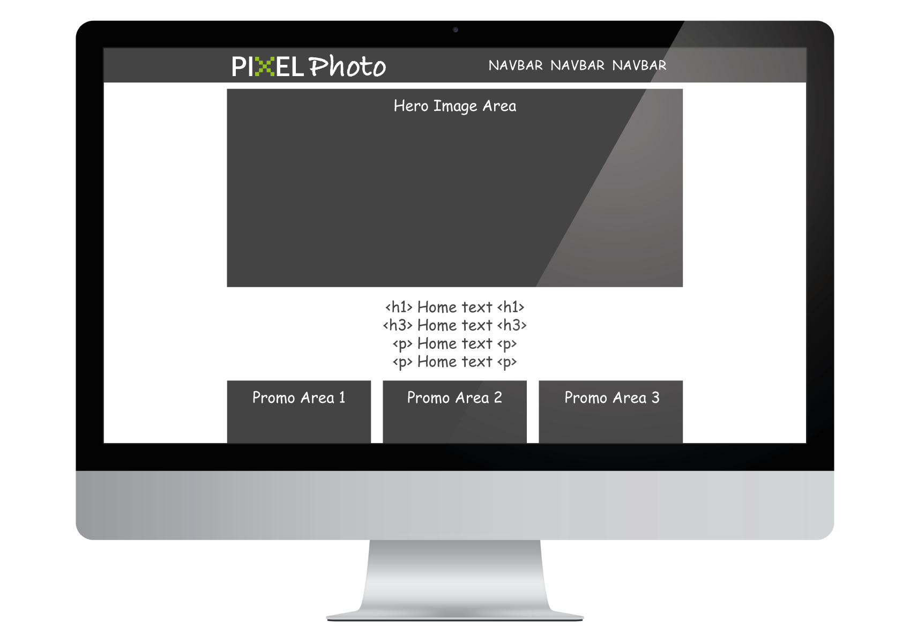

# Pixel Photo

Pixel Photo is a stock photography website for all user disciplines. Whether you are a design agency, a marketing agency, a local print works or a student, all users can get access to premium stock photography at a fraction of the expected price.

Many marketing agencies and designers need access to quality stock photography to speed up proofing processs (while not compromising on the look). And to complete final projects with high resolution files for print. Currently websites like iStock, Shutterstock and DepositPhotos cater for this need but at high prices.

Pixel Photo sells premium quality, high resolution photography without any licensing restrictions for €1 per image.

## UX

#### User Stories
 
- DD Design agency is a company with many demanding clients. The business is growing and inhouse designers are pushing out proofs and a mockups at a fast pace. Image selection can be frustrating when marketers, administrators and designers need to acquire suitable project images, ensure they will be free to use across all areas of the project, and not go over budget. With images for €1, AceWeb will be using Pixel Photo.

- Cork Institute of Technology have their own inhouse design department to cater for the admin needs of the college, and also the design needs specific to each department, students union, etc. The amount of promotional (print and online) materials required at varying points of the year can be staggering. In order for these materials to be current, relevant and engaging, suitable stock elements (photos, vectors, etc) need to be sourced within department budget. With images for €1, AceWeb will be using Pixel Photo.

- AceWeb is a design agency that builds templates for popular open source Content Management Systems. These can be hit and miss and highly subjective as to whether they sell or not. So it is essential that minimal cost goes into each one, while also making them as visually appealing as possible. With images for €1, AceWeb will be using Pixel Photo.

#### Design Considerations

The design is modern and minimalist ensuring a great UX for creative types as well as the general public. Minimal use of secondary colour helps it stand out more. Site is mainly designed in monotone.

#### Responsive Design

The App is designed to work on all devices.

Proposed layout -

## Features

#### User Authentication
- In order to purchase images, users will have to be signed up to the website.
- Different menu items will display depenedent on whether user is signed in or not.

#### eCommerce
- Stripe payment plugin is installed to handle all transactions.

#### Possible features to implement
- With further learning I would extend Django the user model, allowing some users to purchase only and others to upload and sell their own images.

## Technologies Used

- [Python](https://www.python.org/) - Pixel Photo is Python App

- [Django](https://www.djangoproject.com/) - Django is a Python-based free and open-source web framework, which follows the model-view-template architectural pattern

- [Bootstrap CSS](https://bootswatch.com/3/flatly/) - This App utilises HTML to construct pages and is styled with bootstrap CSS. Specifically Bootswatch Flatly theme is used throughout and further styled with the file - /static/css/custom.css

- [JQuery](https://jquery.com) - The project uses **JQuery** to enable Boostrap features

- [Javascript](https://www.javascript.com/) - The App uses Javascript to trigger some features of Bootstrap CSS, i.e. sidenav flyout and dropdown select for categories.

## Testing

#### User Stories addressed

- The App addresses the needs/wants of submitted user stories admirably.
- The App is easy to use and images can be searched/foudn with ease.
- The App is child friendly and easy to use for all ages.

#### Design

- The responsiveness of the App was tested in MAC OSX Safari, Firefox and Chrome browser windows at varying sizes and displays as intended/desired.

- The responsiveness of the App was tested in iPhone6 Chrome and Safari Apps and displays as intended/desired.

- Also tested on a random selection of phones, tablets and desktop browsers using https://www.browserstack.com/ extension in Firefox.

#### Code

- HTML code checked with validator.W3.org returns -
    - Document checking completed. No errors or warnings to show.

- CSS code checked with jigsaw.w3.org/css-validator returns -
    - Congratulations! No Error Found.

- Javascript checked through JSHint.com returns no errors

## Deployment

Pixel Photo App is built in Cloud9 and all code pushed to a Github Respository.

Check out version control for commit steps during development.

`git add .` - Add all files to commit

`git status` - I like to call git status to examine file changes before commit

`git commit -m "A meaningful commit statement"` - Call your commit

`git push` - Push to your repository. Enter credentials

`git push heroku master` - Push to Heroku

`heroku ps:scale web=1` - Start dynos, thus running the App

[Pixel Photo](https://pixel-photo-app.herokuapp.com/) - Pixel Photo is a Python App using the Django framework and deployed to Heroku

## Credits

#### Content
- All photos are sourced from a license-free, free of charge stock photography website - [Free stock photos · Pexels](https://www.pexels.com/)

- All other information is fictional

#### Media
- The Pixel Photo logo is designed by the developer Barry Cunningham

#### Acknowledgements

- The idea for Pixel Photo is my own.

- I received much support from Code Institute Tutors and from the Code Institute Slack community and am very grateful for same.